## 软件工程实践一实验报告
### 1.样例工程的代码结构分析
#### 1.1类的文字描述
world of zuul主要由五个类构成。  
CommandWords类是有效命令类，定义了命令单词字符串数组，对用户输入的每一个指令进行有效性判断，同时还可以输出所有指令。  
Command类为命令类，对应着玩家进行游戏时输入的指令，定义了两个字符串来接收用户输入的一个或两个单词组成的指令。   
Room类是房间类，对应着玩家游戏过程中到达的地点，定义了方向和房间的键值对exit，通过exit可以判断每个方向所连接的房间。  
Parser类是命令分析器，可以将玩家输入的单词解析包装为Command类。  
Game类是游戏中最重要的类，Game类的实例创建游戏并初始化所有房间以及它们不同方向连接的其他房间；初始化解析器接收用户输入的指令并开始游戏。接着进行读取和执行指令来运行游戏。
#### 1.2uml类图
~~~mermaid
classDiagram
class Command{
    -String commandWord
    -String secondWord
    +Command(String firstWord, String secondWord)
    +getCommandWord() String
    +getSecondWord() String
    +isUnknown() boolean
    +hasSecondWord() boolean
}
class Parser{
      -CommandWords commands
      -Scanner reader
      +Parser()
      +getCommand() Command
      +showCommands()
}
class Room{
    -String description
    -HashMap<String, Room> exits
    +Room(String description)
    +setExit(String direction, Room neighbor)
    +String getShortDescription()
    +String getLongDescription()
    -String getExitString()
    +getExit(String direction) Room
}
class Game{
    -Parser parser 
    -Room currentRoom
    -createRooms()
    +play()
    -printWelcome()
    -processCommand(Command command) boolean
    -printHelp()
    -goRoom(Command command)
    -quit(Command command) boolean
}
class Main{
      +main(String[] args)*
}
class CommandWords{
    -String[] validCommands$
    +CommandWords()
    +isCommand(String aString) boolean
    +showAll()
}
Game..>Command
Game "1" o-- "1" Parser
Game "1" o-- "1" Room
Parser "1" --> "1" CommandWords

~~~
### 2.改进功能的实现
#### 2.1扩充和维护样例工程
* 问题：在Game类的processCommand()方法中，当用户输入的命令被辨认出来以后，有一系列的if语句用来分派程序到不同的地方去执行。从面向对象的设计原则来看，这种解决方案不太好，因为每当要加入一个新的命令时，就得在这一堆if语句中再加入一个if分支，最终会导致这个方法的代码膨胀得极其臃肿。  
解决方案：使用switch语句来代替if else语句实现优化。

* 问题：在Game类的createRoom()方法中，当创建好游戏中房间后，不容易操作房间，且在后续地图复杂后或是随机生成功能实现后，Game类会变得十分臃肿。  
解决方案：创建RoomMaker工具类作为工厂，来创建生成Room并提供新的对房间操作方法。

### 2.2功能扩充点
* look命令的实现。可以查看当前房间内的物品
  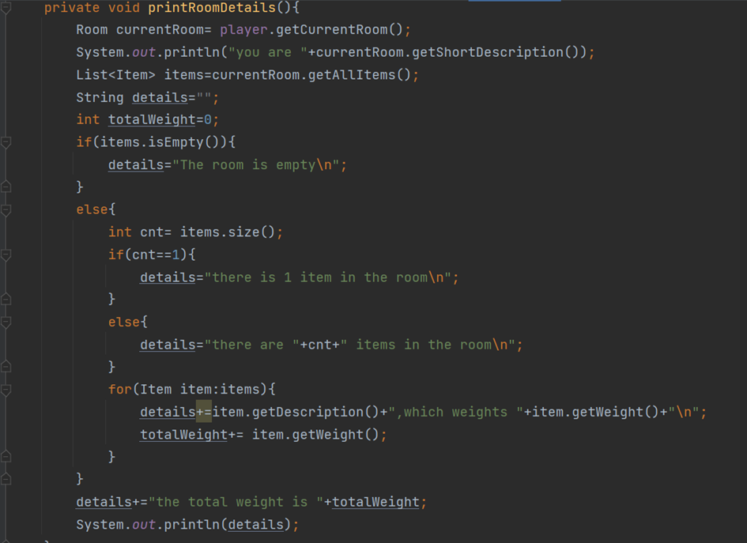
  效果演示：
  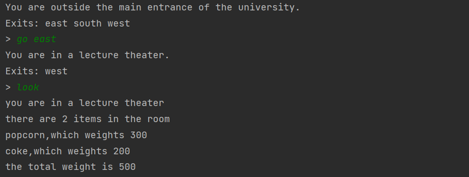
  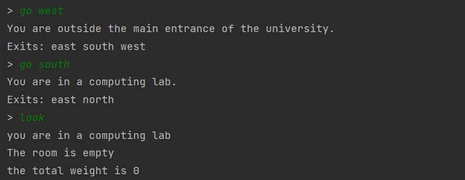

* back命令的实现，可以回溯任意个房间直至起点
  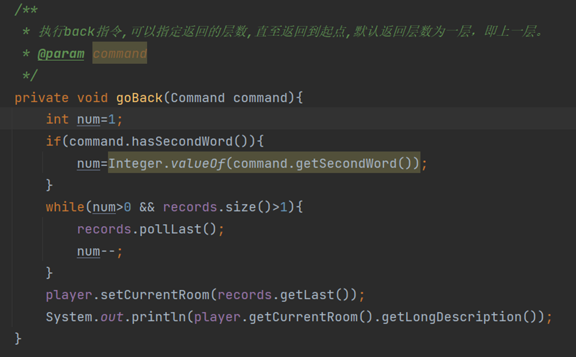
  效果演示：
  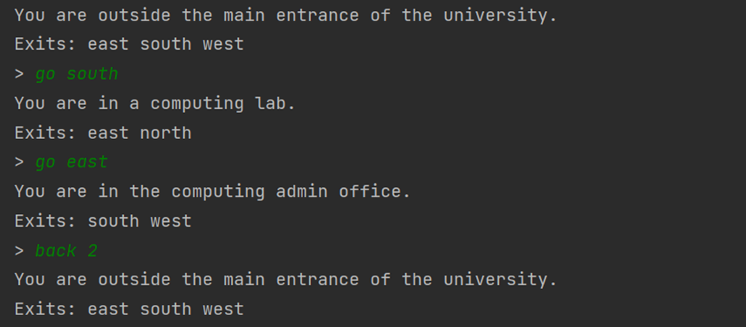
  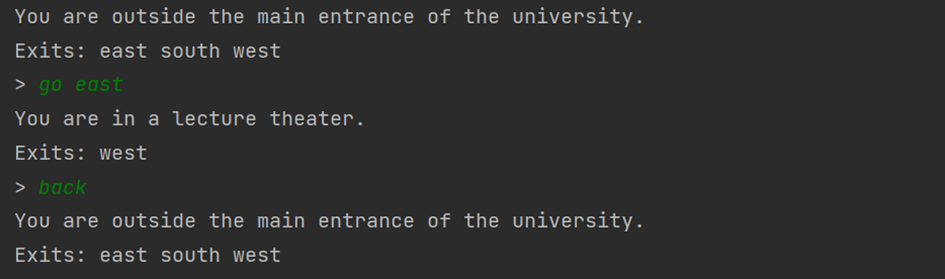
  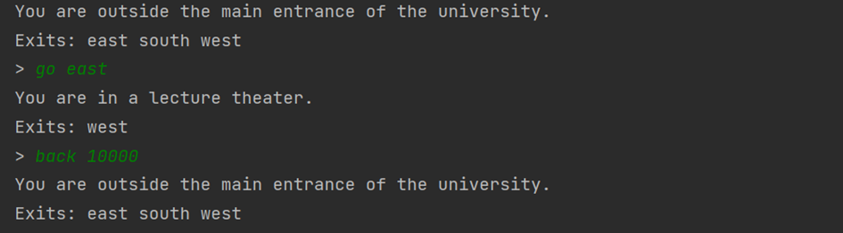
* 传输功能的房间实现，进入房间后会传送到另一个房间  
  goRoom方法：
  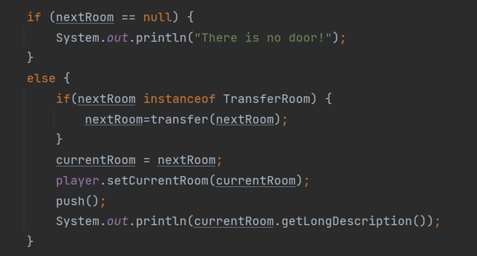
  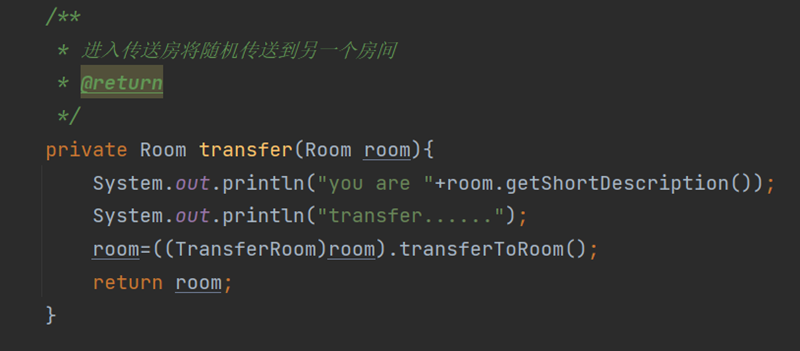
  效果演示：
  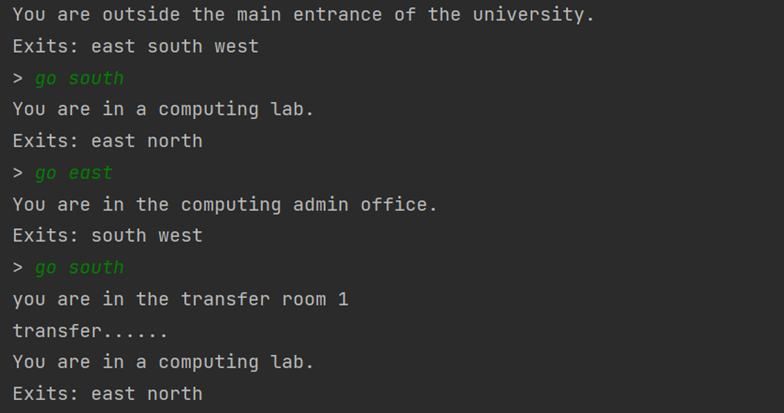
* 新增Player类
  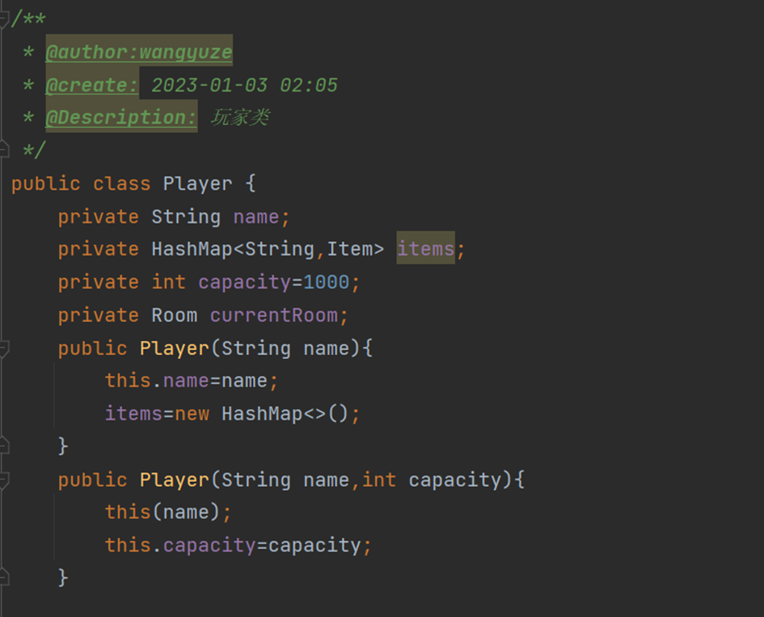
* items指令的实现，查看当前房间和玩家背包的物件
  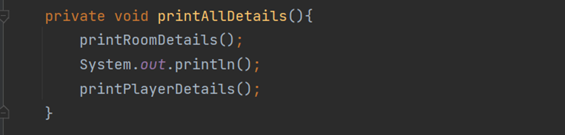
  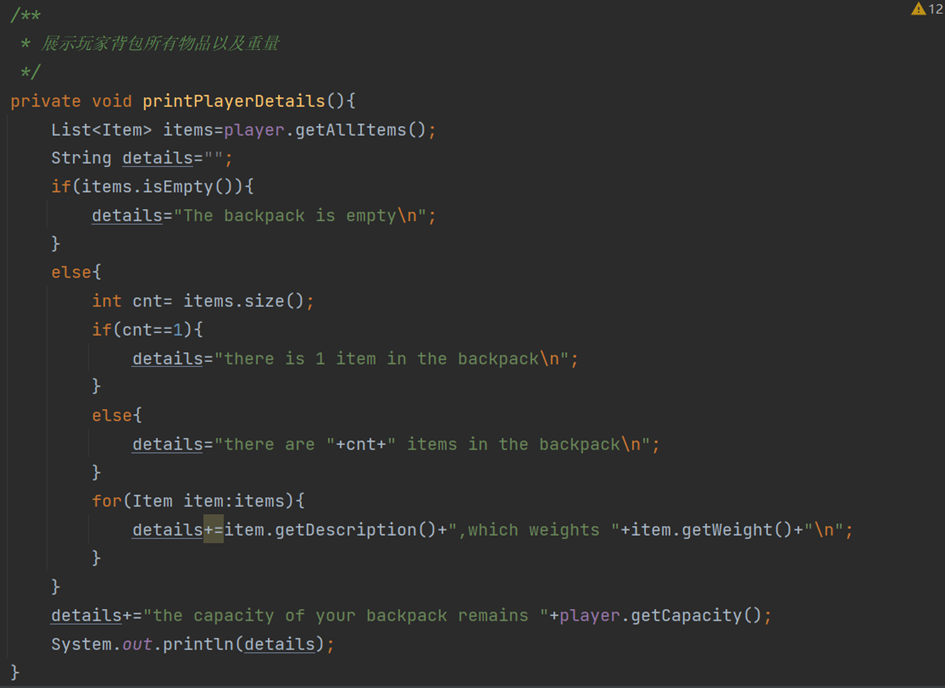
  效果演示：
  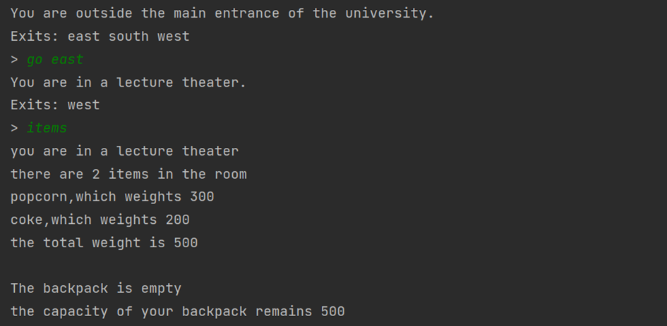
* take指令的实现
  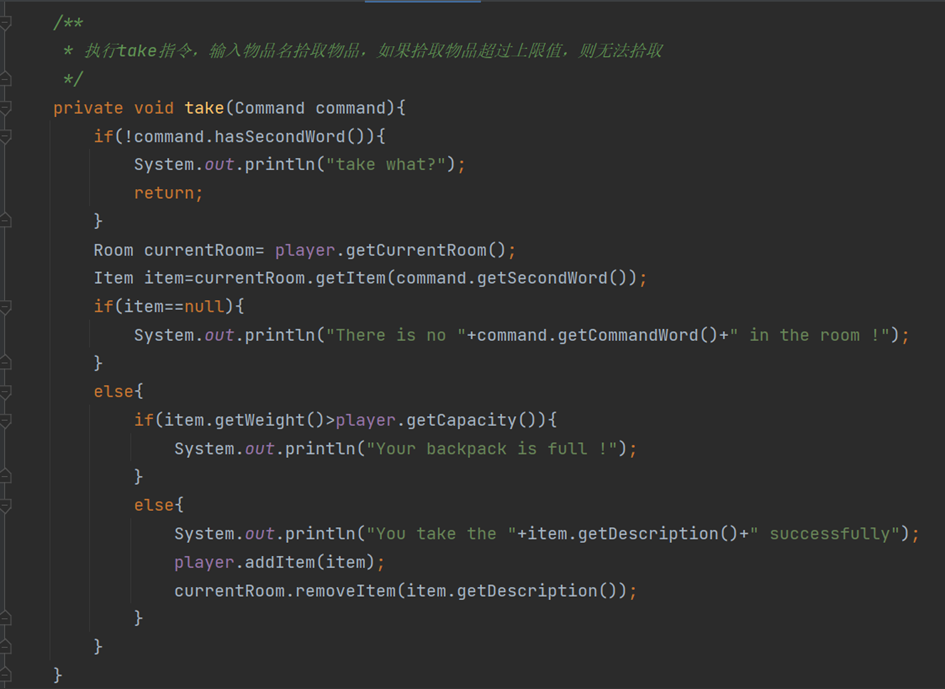
  效果演示：
  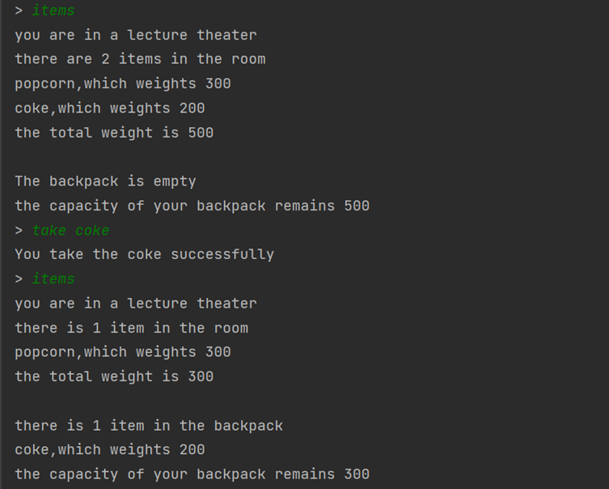
* drop指令的实现
  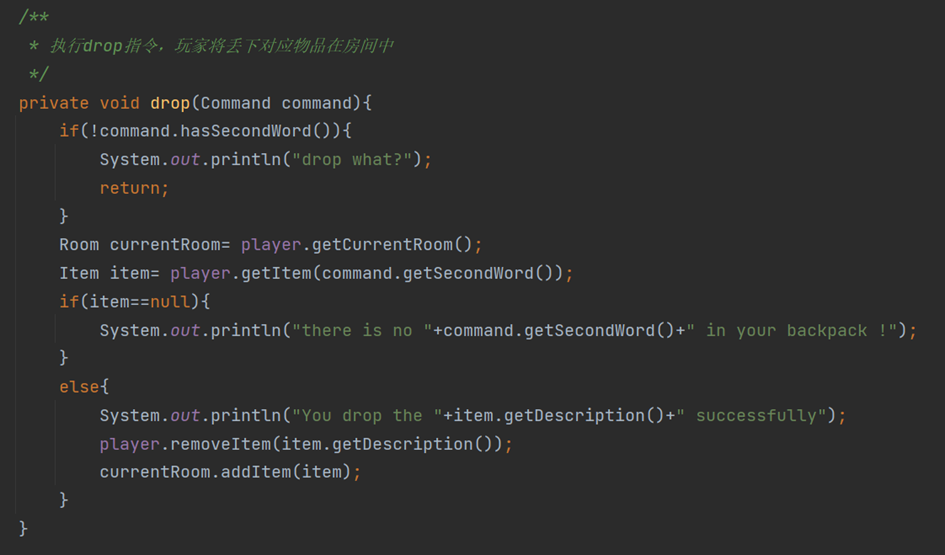
  效果演示：
  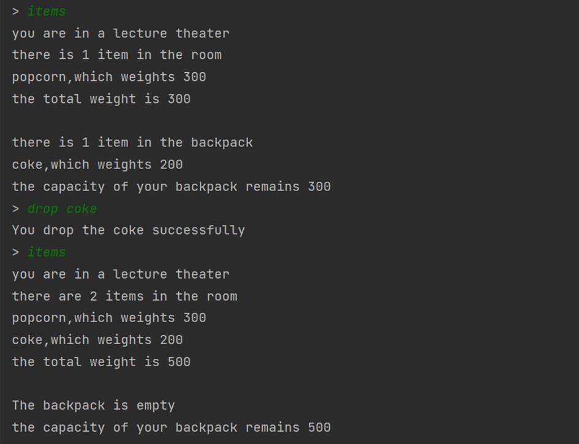
* eat cookie指令的实现：
  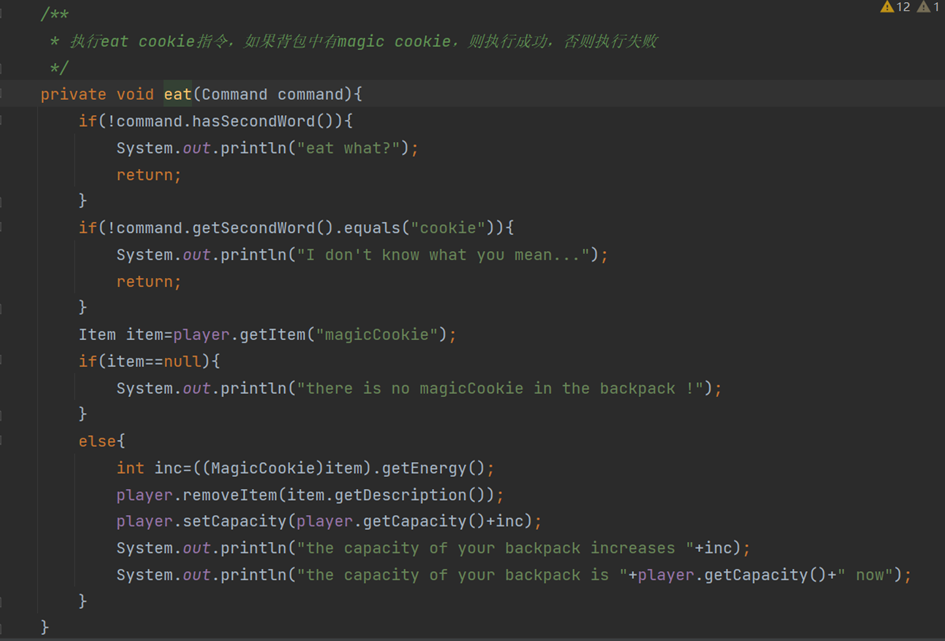
  效果实现：
  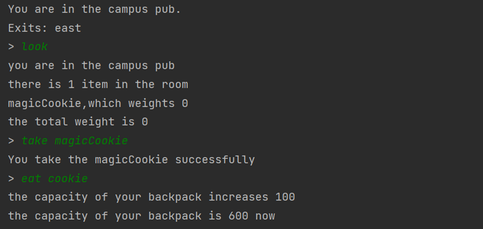

